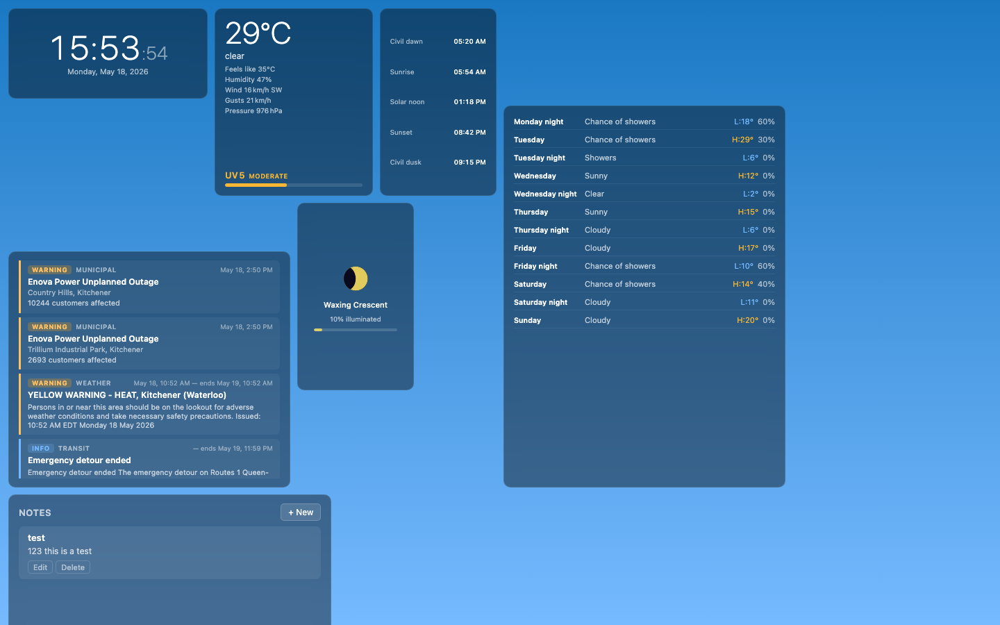
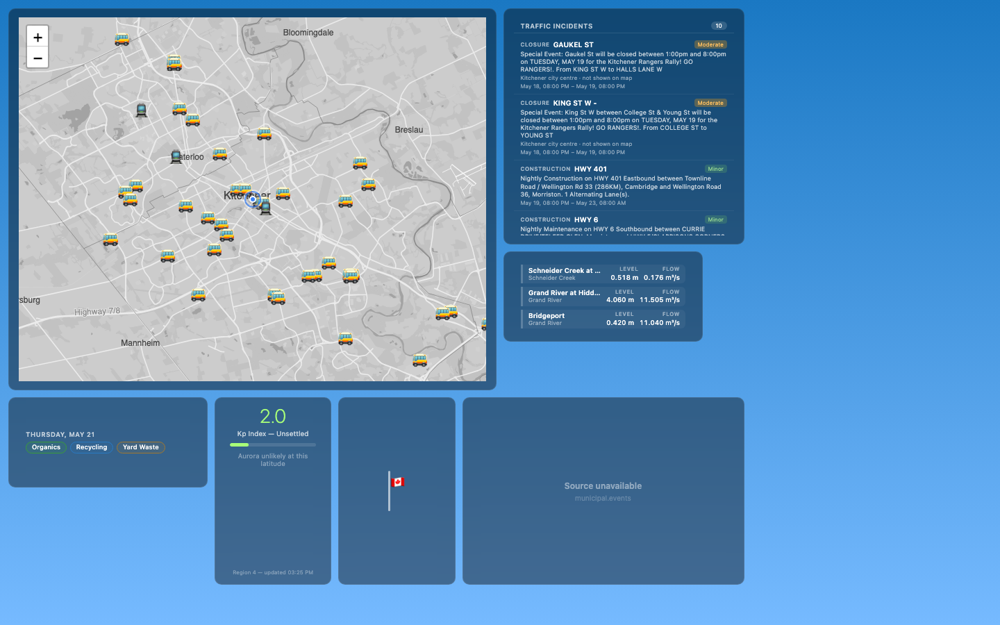

# Cupola

Cupola is a self-hosted, location-aware ambient dashboard for a home, studio, office, or small operations space. A single Go binary runs collectors, serves a REST/SSE API, and hosts a vanilla JavaScript dashboard with draggable widgets.

The project is built around local ownership: you configure the place, the data sources, and the dashboard profiles, then run it on a small always-on machine or kiosk display.

## Use Cases

- A wall-mounted home dashboard for weather, sunrise/sunset, calendar-adjacent notes, waste collection, local alerts, transit, and traffic.
- A local operations display for road conditions, traffic cameras, aircraft, municipal events, waterway gauges, and outage-style alerts.
- A kiosk profile that automatically opens a saved layout with widget chrome suppressed.
- A self-hosted collector hub where external services are polled once and normalized into stable local domain state.

## Capabilities

- Draggable, resizable dashboard widgets with saved profiles.
- REST snapshots and server-sent events for live updates.
- Configurable collectors for Environment Canada weather and alerts, Ecowitt local weather stations, Space Weather Canada solar activity, GTFS/GTFS-RT transit, 511 traffic feeds, dump1090/readsb aircraft, RSS feeds, Canada flag status, municipal alerts/events, GRCA waterway data, notes, and local waste collection schedules.
- Protomaps/PMTiles local map serving with cache-on-first-run behavior.
- Transit agency management stored in SQLite and exposed through admin/API routes.
- Shared notes and dashboard profile import/export.
- Connectivity monitoring with admin force-down controls. Internet-dependent collectors are expected to implement `SetNetCheck(func() bool)` and pause external fetches while public internet is unavailable.
- Kiosk mode via `?profile=<id>&kiosk=1`.

## Screenshots

Basic dashboard with clock, weather, astronomy, alerts, and notes:



Operations dashboard with map, traffic, waterway, waste, solar, flag, and municipal widgets:



## Architecture

- `cmd/cupola/main.go` loads config, registers collectors, opens SQLite stores, wires the connectivity checker, and starts the HTTP server.
- `internal/collector/` contains collector implementations and shared collector interfaces.
- `internal/domain/` contains normalized domain state structs.
- `internal/store/` contains in-memory state, subscriptions, profiles, notes, GTFS cache, and transit agency persistence.
- `internal/api/` exposes REST, SSE, admin, profile, note, transit, and tile routes.
- `cmd/cupola/frontend/` is static HTML/CSS/JS embedded into the binary.

## Dependencies

Runtime:

- Go-built Cupola binary.
- SQLite storage under the configured data directory.
- Network access for configured internet-backed collectors and first-run tile extraction.
- Optional local services such as Ecowitt, dump1090/readsb, or local waste schedule files depending on enabled collectors.

Development:

- Go 1.26 or newer as declared in `go.mod`.
- `make`
- `curl` for vendoring frontend libraries and screenshot profile seeding.
- Node.js for frontend tests and screenshot capture.
- `npx playwright@latest` for `make screenshots`.
- Optional `golangci-lint` for `make lint`.

## Running This Yourself

Create a config:

```sh
cp config.example.yaml config.yaml
```

Edit `config.yaml` for your location, data directory, tile settings, and collectors.

Build and run:

```sh
make build
./cupola -config config.yaml
```

Open the dashboard:

```text
http://localhost:8181
```

Regenerate the README screenshots from a running instance:

```sh
make screenshots SCREENSHOT_BASE_URL=http://localhost:8181
```

The screenshot target seeds two example profiles into the running app and captures kiosk-mode PNGs with Playwright. The profiles live in `docs/examples/`, and the PNGs are written to `docs/screenshots/`.

## Common Commands

```sh
make build
go test ./...
node --test test/frontend/*.test.js
make lint
make screenshots SCREENSHOT_BASE_URL=http://localhost:8181
```

## Configuration

`config.example.yaml` is the canonical starting point. Important sections include:

- `location`: name, latitude, longitude, timezone, and country code.
- `server`: port, data directory, and extra CSP image sources.
- `tiles`: local PMTiles cache settings.
- `connectivity`: public internet probe URL and interval.
- `collectors`: per-source configuration for weather, transit, traffic, aircraft, RSS, flag status, waterways, municipal sources, waste collection, and future IMAP.

Sensitive values can be supplied with environment variable interpolation such as `${IMAP_PASSWORD}`.

## Deployment

Linux/systemd deployment files live in `deploy/`. See `deploy/README.md` for installing the binary as `cupolad`.

## License

MIT. See `LICENSE`.
