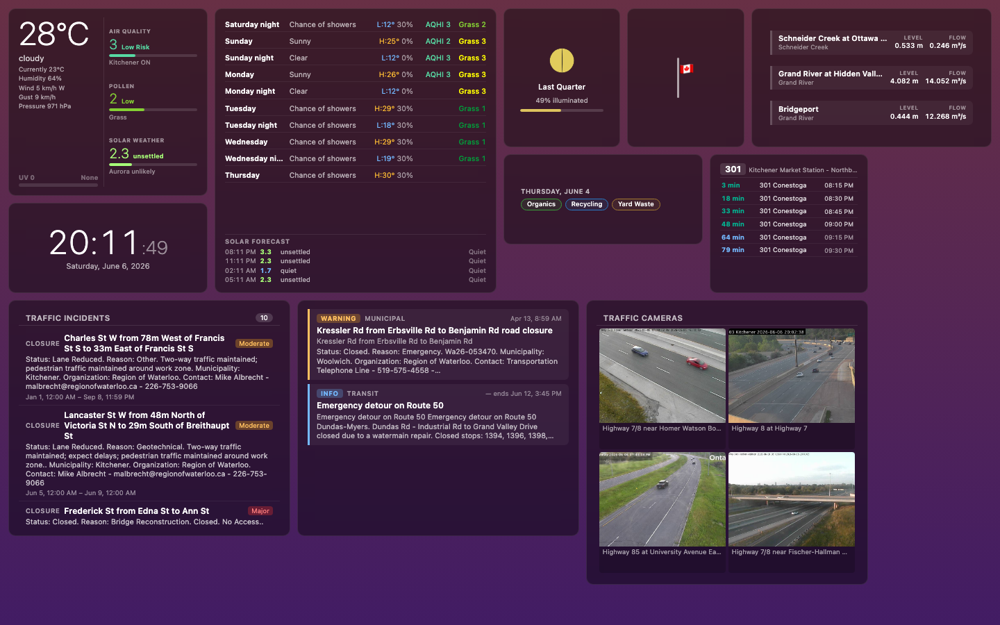
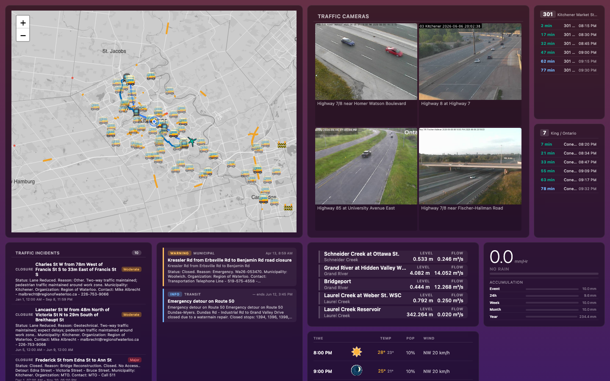

# Cupola

Cupola is a self-hosted, location-aware ambient dashboard for a home, studio, office, or small operations space. A single Go binary runs collectors, serves a REST/SSE API, and hosts an embedded vanilla JavaScript dashboard with draggable widgets.

The project is built around local ownership: configure the place, choose the data sources, save one or more dashboard profiles, and run it on a small always-on machine or kiosk display.

## Use Cases

- A wall-mounted home dashboard for current conditions, forecasts, sunrise/sunset, moon phase, notes, waste collection, local alerts, transit, and traffic.
- A local operations display for road incidents, road conditions, traffic cameras, transit vehicles, aircraft, municipal events, waterway gauges, outages, and weather hazards.
- A kiosk profile that automatically opens a saved layout with widget chrome suppressed.
- A self-hosted collector hub where external services are polled once and normalized into stable local domain state.

## Capabilities

- Draggable, resizable dashboard widgets with saved profiles, profile import/export, and kiosk mode via `?profile=<id>&kiosk=1`.
- REST snapshots and server-sent events for live state updates.
- PWA metadata and service worker assets for installable browser/kiosk use.
- Shared notes stored in SQLite and pushed to dashboards through the same state stream as collectors.
- Admin UI and API for GTFS/GTFS-RT transit agency configuration without restarting Cupola.
- Local PMTiles serving with cache-on-first-run tile extraction.
- Collector health events, frontend outage banners, and admin connectivity controls.
- Internet reachability probing. Public-internet collectors that implement `SetNetCheck(func() bool)` skip external fetches while the checker reports down; LAN and local-file collectors keep running.

## Collector Inventory

| Collector | Domain(s) | Source |
|---|---|---|
| `astro` | `astro` | Local ephemeris calculations for sunrise, sunset, solar noon, moon phase, moonrise, and moonset. |
| `notes` | `notes` | Local SQLite shared notes. |
| `waste.collection` | `waste.collection` | Local JSON waste schedule file with configurable week rollover day. |
| `ecowitt.current` | `weather.current` | Local Ecowitt GW2000-compatible weather station API. |
| `envcanada.forecast` | `weather.forecast` | Environment Canada forecast feeds using nearest-station discovery or a configured station override. |
| `envcanada.hourly_forecast` | `weather.forecast.hourly` | Environment Canada hourly forecast page data. |
| `envcanada.alerts` | `weather.alerts` | Environment Canada weather alert feeds. |
| `envcanada.air_quality` | `weather.air_quality` | Environment Canada AQHI pages with optional AQHI location override. |
| `google.pollen` | `weather.pollen` | Google Pollen API current and forecast pollen levels. |
| `envcanada.solar` / `envcanada.solar.forecast` | `solar.weather.current`, `solar.weather.forecast` | NOAA planetary K-index data, mapped into local solar/aurora conditions. |
| `canada.flag` | `flag.status` | canada.ca half-masting notices, filtered for the configured location. |
| `rss` | `feeds` | Configured RSS/Atom feeds. |
| `dump1090` | `aircraft` | Local dump1090/readsb ADS-B receiver JSON. |
| `gtfsrt.arrivals` | `transit.arrivals` | GTFS static schedules plus GTFS-RT trip updates for subscribed stops. |
| `gtfsrt.vehicles` | `transit.vehicles` | GTFS-RT vehicle positions. |
| `gtfsrt.alerts` | `transit.alerts` | GTFS-RT service alerts. |
| `traffic.incidents` | `traffic.incidents` | Configured traffic incident sources, including 511 APIs and Region of Waterloo road closures. |
| `traffic.cameras` | `traffic.cameras` | 511 traffic camera metadata and snapshot URLs. |
| `traffic.road_conditions` | `traffic.road_conditions` | 511 road condition feeds. |
| `municipal.events` | `municipal.events` | Configured municipal event parsers such as Kitchener road closures. |
| `municipal.alerts` | `municipal.alerts` | Configured municipal alert parsers plus promoted traffic and waterway alerts. |
| `waterway.conditions` | `waterway.conditions` | Configured waterway sources such as GRCA gauges and reservoirs. |

The `house` collector and IMAP dispatcher are represented in the configuration model but are still deferred. Transit collectors are always registered so agencies can be added, edited, enabled, or disabled through the admin/API surface at runtime.

## Regional Sources

The sample configuration is oriented around Kitchener/Waterloo and the Grand River watershed, but the collector model is not limited to that region. Current region-specific parsers and sources include:

- GRCA waterway gauges and managed reservoirs.
- GRCA flood messages promoted into municipal alerts.
- Enova Power outage alerts, including outage polygons where available.
- City of Kitchener snow events, road closures, and utilities disruptions.
- Region of Waterloo regional road closures through ArcGIS, exposed as traffic incidents and optionally promoted into municipal alerts.

See `docs/region-of-waterloo-data-sources.md` for source URLs, discovery notes, and parser details.

## Screenshots

Weather dashboard with current conditions, forecast, alerts, waterway, traffic, transit, waste, and flag widgets:



Details dashboard with map, cameras, transit, hourly forecast, rainfall, waterway, municipal, traffic, and alert widgets:



## Architecture

- `cmd/cupola/main.go` loads config, opens SQLite stores, registers collectors, wires the connectivity checker, initializes tile serving, and starts the HTTP server.
- `internal/collector/` contains collector implementations and parser frameworks.
- `internal/domain/` contains normalized domain state structs consumed by the API and frontend widgets.
- `internal/store/` contains in-memory state, subscriptions, profiles, notes, GTFS cache, and transit agency persistence.
- `internal/api/` exposes REST, SSE, admin, profile, note, transit, detail, config, and tile routes.
- `cmd/cupola/frontend/` is static HTML/CSS/JS embedded into the binary. Widgets register into `window.CupolaWidgets`; PWA files live alongside the frontend as `manifest.json`, `sw.js`, and app icons.

Only one collector may own a domain type. Duplicate domain registration is fatal at startup.

## API Surface

- `GET /api/v1/domains` lists active domains.
- `GET /api/v1/state/{domain}` returns the current state snapshot for a domain.
- `GET /api/v1/stream` opens the SSE stream for domain updates and collector health events.
- `POST /api/v1/subscriptions` and `DELETE /api/v1/subscriptions/{widget_id}` manage widget-specific data needs.
- `GET/POST/DELETE /api/v1/profiles` plus import/export routes manage dashboard profiles.
- `GET/POST/PATCH/DELETE /api/v1/notes` manages shared notes.
- `/api/v1/transit/...` manages transit agency config and exposes routes, stops, and shapes.
- `/api/v1/admin/...` exposes collector health and connectivity test controls.
- `GET /tiles/{z}/{x}/{y}` serves local vector tiles when tile caching is configured.

## Dependencies

Runtime:

- Go-built Cupola binary.
- SQLite storage under the configured data directory.
- Network access for configured internet-backed collectors and first-run tile extraction.
- Optional local services or files such as Ecowitt, dump1090/readsb, and waste schedule JSON depending on enabled collectors.

Development:

- Go 1.26 or newer as declared in `go.mod`.
- `make`
- `curl` for vendoring frontend libraries and screenshot profile seeding.
- Node.js for frontend tests and screenshot capture.
- `npx playwright@latest` for `make screenshots`.
- Optional `golangci-lint` for `make lint`.

## Running This Yourself

Create a config:

```sh
cp config.example.yaml config.yaml
```

Edit `config.yaml` for your location, data directory, tile settings, and collectors. `config.example.yaml` is the canonical starting point.

Build and run:

```sh
make build
./cupola -config config.yaml
```

Open the dashboard:

```text
http://localhost:8181
```

Open the admin UI:

```text
http://localhost:8181/admin.html
```

The dashboard includes PWA metadata and a service worker so supported browsers can install it as an app-style dashboard. Offline behavior should be verified for your deployment before relying on it operationally.

## Configuration

Important config sections:

- `location`: name, latitude, longitude, timezone, and optional country code.
- `server`: listen host/port, data directory, CORS origins, and extra CSP image sources for provider-hosted images.
- `tiles`: local PMTiles cache path, extraction radius, and optional source key.
- `connectivity`: public internet probe URL and interval.
- `collectors`: per-source configuration for weather, air quality, pollen, solar, transit, traffic, aircraft, RSS, flag status, waterways, municipal sources, waste collection, and deferred IMAP/house settings.

Sensitive values can be supplied with environment variable interpolation such as `${GOOGLE_POLLEN_API_KEY}` or `${IMAP_PASSWORD}`.

Network behavior is documented in `docs/collector-network-requirements.md`. Local collectors such as `astro`, `notes`, `waste.collection`, `ecowitt.current`, and `dump1090` do not require public internet access.

## Common Commands

```sh
make build
go test ./...
node --test test/frontend/*.test.js
make lint
make screenshots SCREENSHOT_BASE_URL=http://localhost:8181
```

The screenshot target seeds two example profiles from `docs/examples/` into a running app and captures kiosk-mode PNGs with Playwright. The PNGs are written to `docs/screenshots/`.

## Deployment

Linux/systemd deployment files live in `deploy/`. See `deploy/README.md` for installing the binary as `cupolad`.

## License

MIT. See `LICENSE`.
